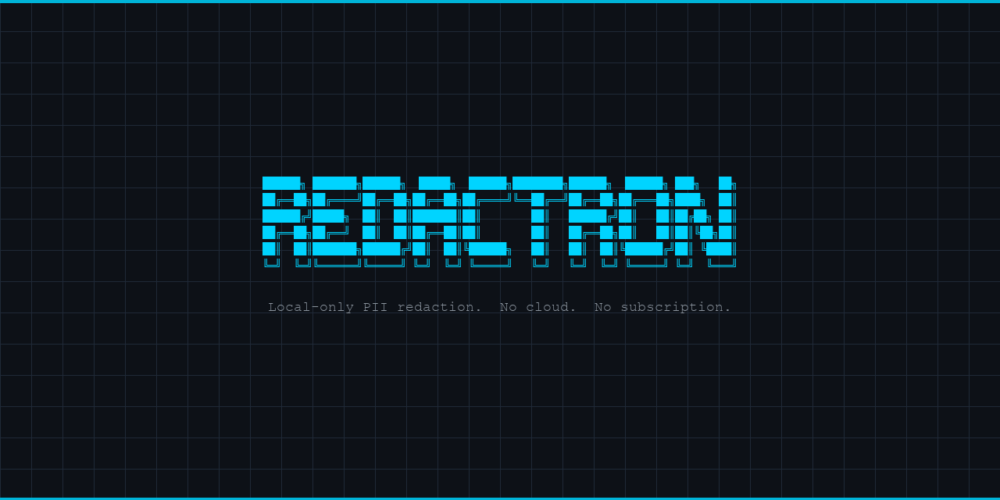

<p align="center">
  
</p>

# Redactron — Local-only PII redaction for PDFs

> Your files stay on your machine. No cloud. No subscription. No telemetry.

[](https://pypi.org/project/redactron/)
[](LICENSE)
[](https://python.org)

Redactron redacts PII from PDFs on your machine. No cloud. No telemetry. No subscriptions.

Define your PII once in a profile, run it against any number of documents, and get a verified redacted output. The PDF never leaves your machine.

Encrypted multi-client vault. Touch ID gated on macOS. Audit log. OCR fallback for scanned documents. AGPL-3.0.

---

<!-- Demo GIF placeholder -->

---

## Why Redactron?

Free online redactors are usually ad-supported and many run analytics on the documents you upload. For medical records, legal documents, or anything covered by HIPAA, GDPR, or attorney-client privilege, that is a serious concern. Adobe Acrobat uploads files to Adobe's servers. iLovePDF and SmallPDF are cloud services with freemium models. You have no visibility into what happens to your files after upload.

Redactron runs entirely on your machine. The codebase has no HTTP client dependency and no outbound socket calls. You can verify this with a packet capture while running a redaction.

The source is AGPL-3.0 and available for inspection. There is no black-box model deciding what to redact. You define exactly what gets removed, and the tool re-scans the output to confirm it worked.

For professional use, the vault stores multiple client profiles encrypted with AES-256-GCM. The master key lives in the macOS login keychain, gated by Touch ID. Every run is logged to a local SQLite database.

## Quickstart

```bash
pip install redactron
redactron init
redactron vault init
redactron profile template --output /tmp/me.yaml
# edit /tmp/me.yaml with your details
redactron profile add --client me --from /tmp/me.yaml
redactron run document.pdf --client me
```

`document_redacted.pdf` lands in the same directory, alongside a verification report.

## Features

- **Profile-driven.** Define your PII once (names, aliases, addresses, phones, emails, SSNs, account numbers, custom regex) and redact any number of PDFs.
- **Encrypted vault.** AES-256-GCM encrypted multi-client profile store. Master key in macOS Keychain.
- **Touch ID gate.** LocalAuthentication soft-gate before every vault access on macOS.
- **OCR fallback.** Auto-triggers on image-only pages via pytesseract. No flag needed.
- **Layout-aware.** Column-aware address bridging prevents cross-column false positives in two-column PDFs.
- **Verification.** Re-scans the redacted output and reports any PII survivors.
- **Audit log.** SQLite record of every run (filename, detections, verification status).
- **Batch mode.** `redactron run ./docs/` redacts an entire directory. Outputs go to `redacted/` subdir.
- **Consolidated report.** Single `YYYY-MM-DD-HHMM_batch-summary.md` per batch run.
- **Dry run.** Preview detections without writing output.

## Profile example

```yaml
version: 1
subject:
  display_name: "Jane Smith"
  aliases: ["Jane", "J. Smith"]
  addresses: ["123 Main Street, Springfield, IL 62701"]
  phones: ["+1-555-867-5309"]
  emails: ["jane@example.com"]
  account_numbers:
    - value: "ACC-9900112233"
      preserve_last: 4
detection:
  fuzzy_match: true
  match_threshold: 0.85
```

Copy `docs/examples/profile-template.yaml` for the full annotated schema.

## Multi-client vault

```bash
redactron vault init
redactron profile add --client alice --from alice.yaml
redactron profile add --client bob --from bob.yaml
redactron run statement.pdf --client alice
redactron profile list
```

## Security model

The vault is AES-256-GCM encrypted at rest. On macOS, the master key is stored in the login keychain and access is gated by a Touch ID prompt via LocalAuthentication.

Touch ID is soft enforcement. It gates redactron's code path, not the keychain item itself. An unsigned Python package cannot use `kSecAttrAccessControl` (requires Apple code-signing entitlements). See [docs/SECURITY.md](docs/SECURITY.md) for the full threat model.

## Performance targets

| Scenario | Target |
|---|---|
| 10-page text PDF | < 3 seconds end-to-end |
| 10-page image PDF (OCR) | < 30 seconds |
| Peak memory per document | < 500 MB |

## Platform support

| Platform | Status |
|---|---|
| macOS | First-class (Touch ID vault) |
| Linux | Planned for v1.1 (keyring via libsecret) |
| Windows | Planned for v1.1 (DPAPI) |

## CLI reference

```
redactron run <path> [--client <id>] [--no-ocr] [--force-ocr] [--no-verify]
                     [--json] [--output <path>] [--quiet] [--per-file-reports]
redactron dry-run <path> [--json]
redactron verify <path>
redactron init
redactron vault init
redactron profile add --client <id> [--name <name>] [--from <yaml>]
redactron profile template [--output <path>] [--client <id>]
redactron profile list
redactron profile show <id> [--reveal]
redactron profile edit <id>
redactron profile delete <id>
redactron profile import <yaml> [--client <id>]
redactron log [--subject <id>] [--limit N]
redactron report <run-id>
redactron --version
```

## Documentation

- [docs/PROFILE.md](docs/PROFILE.md) — full profile schema reference
- [docs/SECURITY.md](docs/SECURITY.md) — threat model, crypto choices, Touch ID implementation
- [docs/PRIVACY.md](docs/PRIVACY.md) — local-only guarantee, audit DB schema, AGPL licensing
- [docs/RELEASING.md](docs/RELEASING.md) — how to cut a release
- [CONTRIBUTING.md](CONTRIBUTING.md) — dev setup, conventions, PR process
- [CHANGELOG.md](CHANGELOG.md) — version history

## License

AGPL-3.0. See [LICENSE](LICENSE).

Redactron depends on [PyMuPDF](https://pymupdf.readthedocs.io/) which is also AGPL-3.0. If you distribute redactron as part of a proprietary product, the AGPL requires you to release your source. See [docs/PRIVACY.md](docs/PRIVACY.md) for details.
