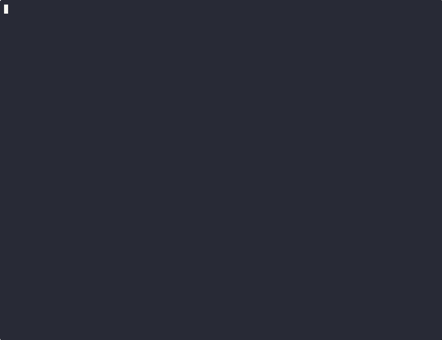

<p align="center">
  
</p>

# Redactron — Batch PII redaction for PDFs. Local-only. No cloud.

> Define your client's sensitive data once. Redact it across hundreds of documents
> in a single command. Verified. Audited. Never leaves your machine.

[](https://pypi.org/project/redactron/)
[](LICENSE)
[](https://python.org)



---

## The problem

You have a folder of bank statements, credit card bills, patient records, or legal
documents. They contain your client's name, address, SSN, account numbers, phone,
and email — scattered across hundreds of pages in dozens of files.

You need to share or store these documents with PII removed. Your options today:

| Option | Problem |
|---|---|
| Manual redaction in Acrobat | Hours of work. Easy to miss fields. Human error. |
| Online redaction tools | Your documents are uploaded to a third-party server. |
| Cloud AI services | API keys, usage costs, data retention policies you can't audit. |
| Scripted regex | Breaks on scanned pages, non-standard formatting, image-based text. |

Redactron is none of those. It runs entirely on your machine, handles scanned pages
via OCR, and re-scans every output to verify nothing was missed.

---

## What it does

Describe your client's PII once in a profile:

```yaml
subject:
  display_name: "Alice Johnson"
  aliases: ["Alice", "A. Johnson"]
  addresses: ["123 Main Street, Springfield, IL 62701"]
  phones: ["+1-555-867-5309"]
  emails: ["alice@example.com"]
  ssns: ["078-05-1120"]
  account_numbers:
    - value: "0021305789Q834"
      preserve_last: 4        # redacts to ••••••••••Q834
detection:
  fuzzy_match: true
  match_threshold: 0.85
```

Then run it against any number of documents:

```bash
redactron run ./statements/ --client alice
```

Every PDF in the folder is processed. Scanned pages trigger OCR automatically.
The output is verified — redactron re-scans each redacted file and flags any
survivors. A consolidated audit report is written for the batch.

---

## Real-world use cases

**Financial document packages**
Mortgage applications, loan files, and refinancing packages require submitting
months of bank statements and credit card history. A single client profile covers
all of them. Account numbers are redacted to the last 4 digits — the format
lenders and compliance teams expect — while transaction history is preserved intact.

**Medical records**
Patient records shared between providers or submitted to insurers must have
identifying information removed. Redactron handles name, date of birth, address,
phone, insurance ID, and custom fields in one pass across any number of scanned
or digital documents.

**Legal discovery**
Law firms producing documents in discovery need to redact client PII consistently
across large document sets. Redactron's audit log provides a verifiable record of
every redaction made, on every file, with verification status.

**Accounting and tax preparation**
Accountants handling client financial records can define a profile per client and
process a full year of statements — bank, brokerage, credit card — in minutes
rather than hours.

**Scanned and image-based documents**
Many financial institutions (Chase, Wells Fargo, and others) produce statements
where account numbers are rendered as images or in non-selectable text layers.
Redactron's OCR fallback handles these automatically — no flag needed, no manual
intervention.

---

## Quickstart

```bash
pip install redactron
redactron init
redactron vault init

# Get the profile template
redactron profile template --output /tmp/alice.yaml
# Fill in PII values, then import (source file is securely wiped after import)
redactron profile add --client alice --from /tmp/alice.yaml

# Redact a single file
redactron run statement.pdf --client alice

# Redact an entire folder — outputs go to ./statements/redacted/
redactron run ./statements/ --client alice
```

`statement_redacted.pdf` lands alongside the input. For a folder, all redacted
files go to `redacted/` and a consolidated batch report is written to
`redacted-reports/`.

---

## Features

- **Profile-driven.** Define PII once — names, aliases, addresses, phones, emails,
  SSNs, account numbers, custom regex — and redact any number of PDFs.
- **Encrypted vault.** AES-256-GCM encrypted multi-client profile store. Master
  key in macOS Keychain.
- **Touch ID gate.** Every vault access triggers a biometric prompt via
  LocalAuthentication. No password to type or expose.
- **OCR fallback.** Auto-triggers on image-only pages via pytesseract. Handles
  scanned documents and statements with non-selectable text layers.
- **Partial redaction.** `preserve_last: 4` on account numbers redacts the prefix
  while keeping the suffix visible — the format most institutions and lenders require.
- **Layout-aware.** Column-aware address bridging prevents cross-column false
  positives in two-column PDFs.
- **Verification pass.** Re-scans every redacted output with the same detectors.
  Survivors are reported and flagged in the audit log.
- **Audit log.** SQLite record of every run — filename, detections, verification
  status, timestamp.
- **Batch mode.** `redactron run ./docs/` processes an entire directory. Outputs
  go to a `redacted/` subdirectory.
- **Consolidated report.** Single `YYYY-MM-DD-HHMM_batch-summary.md` per batch run.
- **Dry run.** Preview detections without writing any output.
- **Secure wipe.** Profile YAML files are overwritten with random bytes and deleted
  after import. The plaintext never persists on disk.
- **Zero telemetry.** No HTTP client dependency. Verified by packet capture.

---

## Security model

The vault is AES-256-GCM encrypted at rest. On macOS, the master key is stored in
the login keychain and every access is gated by a Touch ID prompt via
LocalAuthentication.

Touch ID is soft enforcement. It gates redactron's code path, not the keychain item
itself. An unsigned Python package cannot use `kSecAttrAccessControl` (requires
Apple code-signing entitlements). See [docs/SECURITY.md](docs/SECURITY.md) for the
full threat model.

---

## Profile example

```yaml
version: 1
subject:
  display_name: "Jane Smith"
  aliases: ["Jane", "J. Smith"]
  addresses: ["123 Main Street, Springfield, IL 62701"]
  phones: ["+1-555-867-5309"]
  emails: ["jane@example.com"]
  account_numbers:
    - value: "0021305789Q834"
      preserve_last: 4
detection:
  fuzzy_match: true
  match_threshold: 0.85
```

Copy `docs/examples/profile-template.yaml` for the full annotated schema.

---

## Multi-client vault

```bash
redactron vault init
redactron profile add --client alice --from alice.yaml
redactron profile add --client bob --from bob.yaml
redactron run statement.pdf --client alice
redactron profile list
```

---

## Performance targets

| Scenario | Target |
|---|---|
| 10-page text PDF | < 3 seconds end-to-end |
| 10-page image PDF (OCR) | < 30 seconds |
| Peak memory per document | < 500 MB |

---

## Platform support

| Platform | Status |
|---|---|
| macOS | First-class (Touch ID vault) |
| Linux | Planned for v1.1 (keyring via libsecret) |
| Windows | Planned for v1.1 (DPAPI) |

---

## Roadmap

### v1.1 — Linux and Windows support
Keyring via libsecret (Linux) and DPAPI (Windows). Same vault format, same CLI.

### v1.2 — On-device LLM assistance *(planned)*

A small, fully local language model (Phi-3-mini or equivalent, running via Ollama
or llama.cpp) will add:

- **Profile bootstrapping.** Drop in a sample document and the LLM drafts your
  profile — it reads the document and proposes the fields to redact. You review
  and confirm. No manual YAML editing required.
- **Visual PII detection.** Some documents render account numbers as images or use
  non-standard masking (e.g., `••••5678`, `Acct ending 1234`). A vision-capable
  model reads the rendered page and flags these for redaction even when the text
  layer is empty or garbled.
- **Unknown field discovery.** The LLM surfaces fields it finds across a batch that
  don't match any profile entry — *"found 'Member ID: 8821045' in 7 files, not in
  profile"* — so you can decide whether to add them.
- **OCR correction.** Tesseract misreads characters in scanned documents (`0` vs
  `O`, `1` vs `l`). The LLM post-processes OCR output to correct likely errors in
  the context of known PII patterns, improving detection recall.

All LLM inference runs on-device. No API key. No data leaves the machine. The LLM
is advisory — it surfaces suggestions, redactron's rule-based engine makes the
final call.

---

## CLI reference

```
redactron run <path> [--client <id>] [--no-ocr] [--force-ocr] [--no-verify]
                     [--json] [--output <path>] [--quiet] [--per-file-reports]
redactron dry-run <path> [--json]
redactron verify <path>
redactron init
redactron vault init
redactron profile add --client <id> [--name <name>] [--from <yaml>]
redactron profile template [--output <path>] [--client <id>]
redactron profile list
redactron profile show <id> [--reveal]
redactron profile edit <id>
redactron profile delete <id>
redactron profile import <yaml> [--client <id>]
redactron log [--subject <id>] [--limit N]
redactron report <run-id>
redactron --version
```

---

## Documentation

- [docs/PROFILE.md](docs/PROFILE.md) — full profile schema reference
- [docs/SECURITY.md](docs/SECURITY.md) — threat model, crypto choices, Touch ID implementation
- [docs/PRIVACY.md](docs/PRIVACY.md) — local-only guarantee, audit DB schema, AGPL licensing
- [docs/RELEASING.md](docs/RELEASING.md) — how to cut a release
- [CONTRIBUTING.md](CONTRIBUTING.md) — dev setup, conventions, PR process
- [CHANGELOG.md](CHANGELOG.md) — version history

**[Read the v1.0 launch post →](LAUNCH.md)**

---

## License

AGPL-3.0. See [LICENSE](LICENSE).

Redactron depends on [PyMuPDF](https://pymupdf.readthedocs.io/) which is also
AGPL-3.0. If you distribute redactron as part of a proprietary product, the AGPL
requires you to release your source. See [docs/PRIVACY.md](docs/PRIVACY.md) for
details.
